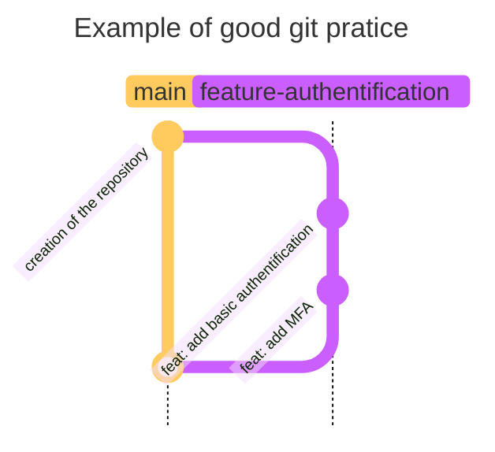

# Good git pratice

This guide is a summary of good git pratice, from how to commit to how to make a good PR

## branch

When working on your project, you need to create a branch with the good term:

- `feature`:      when creating a new feature for your project. Example: `feature-login-system`
- `doc`:          when writing documentation for your project. Example: `doc-readme-update`
- `fix`:          when making a fix. Example: `fix-password-reset`
- `test`:         For branches where new tests are being developed. Example: `test-user-authentication`
- `release`:      For release branches. Example: `release-v1.0.0`

## commit

When commiting code to your branch, you need to add a prefix to it that summarize what you have changed, don't forget to write a comprehensive comment:

- `feat`:       Introducing a new feature.
- `fix`:        Fixing a bug or addressing an issue.
- `chore`:      Routine tasks, maintenance, or general refactoring that doesn't  - introduce new features or fix bugs.
- `doc`:        Documentation-related changes.
- `style`:      Changes that don't affect the code's meaning, such as formatting or whitespace adjustments.
- `rfr`:        Restructuring code without adding new features or fixing bugs.
- `test`:       Adding or modifying tests.
- `perf`:       Changes aimed at improving code performance.
- `build`:      Changes affecting the build system or external dependencies.
- `ci`:         Changes related to continuous integration configuration and scripts.
- `revert`:     Reverting a previous commit.
- `merge`:      Commits related to merging branches.
- `release`:    Version or release-related changes.
- `deps`:       Updating dependencies.

## Pull request

When you are finised with the work on your branch, you do a PR on the main, make a comprehensive comment in your PR

## Example

